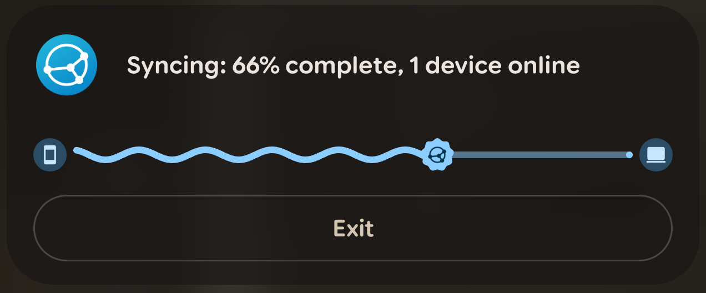

<div align="center">


# Syncthing Live Update

**Syncthing's sync progress as an Android Live Update — in the status bar chip, on the lock screen and on Always-on Display.**

No second notification. No REST polling. No API key.

<br>

[](https://github.com/MrxSiN/syncthing-liveupdate/releases)
[](https://github.com/MrxSiN/syncthing-liveupdate/releases)
[-3DDC84?logo=android&logoColor=fff&style=for-the-badge)](https://developer.android.com/about/versions/16)
[](https://github.com/researchxxl/syncthing-android)
[](https://github.com/libxposed/api)

</div>

---

> [!NOTE]
> **Compatible with the latest Syncthing-Fork.** Every class, method and field this module
> hooks is verified present in **2.1.5.0** (latest stable) and **2.1.6.0-rc.1** (latest
> pre-release) from [researchxxl/syncthing-android](https://github.com/researchxxl/syncthing-android),
> by `scripts/check-host-contract.sh`, which CI re-runs weekly. 2.1.5.0 is also confirmed on a
> physical device.

## Why it works this way

Android 16 introduced Live Updates: promoted ongoing notifications that surface in the status
bar chip, on the lock screen and on Always-on Display. Syncthing already knows how far along a
sync is — it simply has no way to say so in that format. This module supplies the missing part
and nothing else.

|  | |
|---|---|
| 🔁 **One notification, not two** | The notification Syncthing already posts is rewritten on its way to the system. Its title, icon, Exit action and tap target are kept, and it stays the foreground-service notification the app depends on. |
| 🔌 **No polling** | Every figure is read from the host's own callbacks, at the moment the host recalculates it. No REST calls, no API key, no timers, no background service. |
| 🧩 **Contained** | Every hook is protective and installs through one boundary. A hook that cannot install costs its own feature and nothing else — Syncthing is left exactly as it was. |
| 🎯 **Only this app** | `FLAG_PROMOTED_ONGOING` is restored for this module's own channel in Syncthing-Fork alone. Every other notification on the device keeps the platform's verdict. |
| 🔍 **Found by shape, not just by name** | The hooked host methods are located with [DexKit](https://github.com/LuckyPray/DexKit) before falling back to a name lookup, so an upstream rename does not silently disable a feature. |
| 😴 **Idle is untouched** | When nothing is transferring the notification is passed straight through, so the idle behaviour is the one Syncthing ships with. |

---

## Features

<details open>
<summary><b>📊 The Live Update</b></summary>
<br>

While a transfer runs, Syncthing's own persistent notification becomes a promoted Live Update
with a `Notification.ProgressStyle` bar for overall sync completion, and a percentage in the
status bar chip through `setShortCriticalText`.

| Element | What it shows |
|---|---|
| **Progress bar** | Overall completion, reported in tenths of a percent so movement is smooth rather than stepped |
| **Start and end icons** | Tonal circles holding the Material Symbols `smartphone` and `computer` glyphs, in the order the data moves |
| **Tracker** | The nine-sided "cookie" from the Material 3 Expressive shape set, filled with Syncthing's primary colour and carrying the host's own glyph |
| **Second line** | The folders currently transferring, by their configured labels. Past two, the remainder becomes a count |
| **Status icon badge** | Down while this device pulls, up while a remote pulls from it, both arrows when each happens at once |
| **Chip text** | The completion percentage |

<table>
<tr>
<td align="center"><br><sub>The notification during an upload: host title and Exit action untouched</sub></td>
<td align="center"><br><sub>The same notification as a status bar chip</sub></td>
</tr>
</table>

Colours are Material 3 roles derived from Syncthing's blue `#0891D1` with the fidelity scheme,
resolved for the light or dark theme. SystemUI draws the progress icons untinted, so each
shape and its glyph are rendered into a bitmap once per theme.

</details>

<details open>
<summary><b>🌊 SystemUI polish</b></summary>
<br>

`ProgressStyle` cannot express everything, so the rest is added where SystemUI draws it. Each
hook first checks it is looking at Syncthing-Fork's notification; every other app's bar and
chip are drawn by the platform exactly as before.

| Polish | What changes |
|---|---|
| **Wavy progress** | The filled part of the bar becomes a Material 3 Expressive wave — 4dp stroke, 3dp amplitude, 40dp wavelength — flowing one wavelength per second and flattening near either end, followed by a flat track and a stop dot |
| **Spring motion** | Each update is applied at the value on screen, and the bar then travels to the new value on a critically damped spring, so it never overshoots and never teleports |
| **Chip colour** | The chip is filled with Syncthing's primary colour and its content drawn in on-primary, instead of the system surface grey Android 17 would otherwise use |

This whole section is optional. Without the SystemUI scope the Live Update still works; the
bar is simply the flat one the platform draws.

It is also self-limiting. The wave asks for a new frame at most every 16ms, so a 120Hz panel
does not double the work, and three failed draws switch the custom drawing off for the rest of
the process rather than retrying on every frame.

</details>

<details open>
<summary><b>🛡 Failing open</b></summary>
<br>

A module that patches private code will eventually meet a build it does not fit, and the only
acceptable outcome is that a feature disappears rather than the host breaking.

| Boundary | What it guarantees |
|---|---|
| `ModuleRuntime.hook(...)` | The single path to the framework. A failed installation is caught and logged, and returns `null`, so every feature inherits the same policy |
| `Reflect` | Returns `null` or `false` for anything it cannot reach, after recording why |
| `PlatformContract` | An Android release the module has not been read against keeps the base Live Update and deliberately leaves the SystemUI polish off, rather than guessing at private names |
| `WavyProgressTrack` | Gives up on the custom drawing after three failed draws and lets the platform draw the bar |

Reflection failures are reported once each, classified and with the context to act on:

```text
Reflection ABSENT: …ColorsModel$Custom expected=any constructor,
  sdk=37, fingerprint=google/husky/husky:17/CP3A.260905.009/…, cause=none
```

`ABSENT` is an upstream rename, `DENIED` a tightened hidden-API policy, `THREW` a member that
still exists but no longer behaves as assumed.

</details>

<details>
<summary><b>🧪 Keeping up with Syncthing-Fork</b></summary>
<br>

The update most likely to break this module is an upstream release that renames or removes
something it hooks. Compiling cannot notice that, because the host is not on the module's
classpath.

```bash
scripts/check-host-contract.sh 2.1.6.0 v2.1.6.0-rc.1
```

The script downloads that release's APK and looks for every hooked class, method and field in
its dex string pools. CI runs it weekly and on demand — so an upstream release shows up as a
failing scheduled run rather than as a surprise on someone's phone.

</details>

---

## Status

**v1.1.1.** Compatible with **Android 16+ (API 36)** and **Syncthing-Fork 2.1.5.0 / 2.1.6.0-rc.1**.

| Component | Evidence |
|---|---|
| **Android 17 (SDK 37)** | Pixel 8 Pro, builds `CP2A.260805.005` and `CP3A.260905.009`, Vector 2.2. Full path confirmed on device |
| **Android 16 (SDK 36)** | **Not tested on a device.** Its promotion path is covered by unit tests only |
| **Syncthing-Fork 2.1.5.0** | Contract verified, and exercised on a device |
| **Syncthing-Fork 2.1.6.0-rc.1** | Contract verified |

Known limits:

- Android 16 asks for promotion through `setColorized` and Android 17 through
  `setRequestPromotedOngoing`; only the Android 17 path has run on hardware.
- The SystemUI polish reads private SystemUI internals. It switches itself off, with a reason
  in the log, on a release the module has not been read against.

## Requirements

| | |
|---|---|
| **Android** | 16 or newer (API 36). Live Updates do not exist before that |
| **Host** | [Syncthing-Fork](https://github.com/researchxxl/syncthing-android) (`com.github.catfriend1.syncthingfork`) |
| **Framework** | [Vector](https://github.com/JingMatrix/Vector) v2.2+ with Magisk or KernelSU and Zygisk. LSPatch cannot run this module — the promotion flag has to be restored inside `system_server`, which a rootless patch cannot reach |
| **Root** | Required by the framework; the module itself asks for none |

Built against the modern [libxposed API](https://github.com/libxposed/api)
(`io.github.libxposed:api`), not the legacy `de.robv.android.xposed` bridge.

## Install

```
1. Install the APK from Releases
2. Enable Syncthing Live Update in Vector
3. Grant the scope: system server, Syncthing-Fork and SystemUI
4. Reboot once
5. Watch logcat for the tag SyncthingLiveUpdate
```

The module declares a **static scope**, but the system server entry generally has to be
confirmed by hand. With the Vector CLI, steps 2 and 3 are:

```sh
su -c '/data/adb/lspd/cli modules enable io.github.mrxsin.syncthingliveupdate'
su -c '/data/adb/lspd/cli scope set io.github.mrxsin.syncthingliveupdate system/0 com.github.catfriend1.syncthingfork/0 com.android.systemui/0'
```

The module declares `autoHotReload`, so a new build is loaded into running processes rather
than waiting for a reboot. Installing an update was confirmed to take effect in the Syncthing
process immediately, without restarting anything. `system_server` is the slower half: until it
holds the new build, the module says so in the log rather than leaving the Live Update
silently unpromoted, and `su -c 'stop; start'` forces it in about a boot animation's time.
Upgrading *to* this version is the one case that still needs that, because the version being
replaced never declared the flag.

A healthy start logs the framework, the platform contract, the host method being observed and
the channel it will promote on:

```text
Syncthing Live Update v1.1.1 loaded in com.github.catfriend1.syncthingfork,
  framework=Vector 2.2, api=102, contract=Android 17 (API 37), …
DexKit indexed 5 dex file(s) in 52ms
Observing public void …NotificationHandler.updatePersistentNotification(…)
Promoting the host notification on channel 05_syncthing_live_update
```

## Build

```bash
./gradlew test assemble
```

```powershell
.\gradlew.bat test assemble
```

The APK lands in `app/build/outputs/apk/release/`. Release signing is read from the
environment — `ANDROID_KEYSTORE_PATH`, `ANDROID_KEYSTORE_ALIAS`, `ANDROID_KEYSTORE_PASSWORD`
and `ANDROID_KEY_PASSWORD` — so no credential reaches version control, and leaving them unset
produces an unsigned build. CI uses the same single path.

`scripts/check-project.sh` validates the build configuration, the module declaration and the
shape of the code the hooks depend on. It runs first in CI and is worth running before a commit.

---

## How it works

```
Syncthing-Fork ──NotificationHandler.updatePersistentNotification──▶ SyncProgressTracker
                                                                     │
                                       Service.startForeground ◀─────┴─▶ LiveUpdatePromoter ─▶ ExpressiveAppearance
                                                │
system_server ──NotificationManagerService.fixNotificationWithChannel──▶ FLAG_PROMOTED_ONGOING
                                                │
SystemUI ──NotificationProgressDrawable.draw───▶ WavyProgressTrack
         ──NotificationProgressBar.setProgressModel──▶ ProgressBarMotion
         ──OngoingActivityChipModel$Active──▶ StatusBarChipColors
```

Full detail, per process, is in [docs/architecture.md](docs/architecture.md).

| Page | What is in it |
|---|---|
| [docs/architecture.md](docs/architecture.md) | What is hooked in each process, and why it is hooked there |
| [docs/compatibility.md](docs/compatibility.md) | Which Android and Syncthing-Fork releases are supported, and which have actually been tested |
| [docs/troubleshooting.md](docs/troubleshooting.md) | What each log line means, and what to do about it |

<details>
<summary><b>Why the channel changes during a transfer</b></summary>
<br>

The host posts its persistent notification on an `IMPORTANCE_MIN` channel, and the platform
refuses to promote anything posted there. During a transfer the notification is moved to
`05_syncthing_live_update` at `IMPORTANCE_LOW`; when the sync completes it goes back to
`01_syncthing_persistent` and behaves exactly as before.

</details>

<details>
<summary><b>Why a flag has to be restored in system_server</b></summary>
<br>

Android sets `FLAG_PROMOTED_ONGOING` only for a package holding
`android.permission.POST_PROMOTED_NOTIFICATIONS`. Syncthing-Fork does not declare it, and an
install-time permission cannot be granted after the fact — `pm grant` will not do it. So the
module restores that single flag, and only when the package is Syncthing-Fork **and** the
channel is the module's own. Nothing else about the platform's promotion policy is touched.

</details>

---

## Credits

| Project | Contribution |
|---|---|
| [Syncthing-Fork](https://github.com/researchxxl/syncthing-android) | The host application whose sync figures and notification this module builds on. MPL-2.0 |
| [Vector](https://github.com/JingMatrix/Vector) by JingMatrix | The ART hooking framework used in the app process, the system server and SystemUI. GPL-3.0 |
| [libxposed API](https://github.com/libxposed/api) | The modern Xposed module API this module compiles against. Apache-2.0 |
| [DexKit](https://github.com/LuckyPray/DexKit) by LuckyPray | Finds the hooked host methods by shape, so an upstream rename does not silently disable a feature. Apache-2.0 |
| [Material Symbols](https://github.com/google/material-design-icons) | The `smartphone` and `computer` glyphs at either end of the progress bar. Apache-2.0 |

## Disclaimer

This project is not affiliated with, endorsed by, or sponsored by the Syncthing project or the
maintainers of Syncthing-Fork. It is provided for educational and personal use. Host app
updates or Android platform changes may break the hooks without notice.
